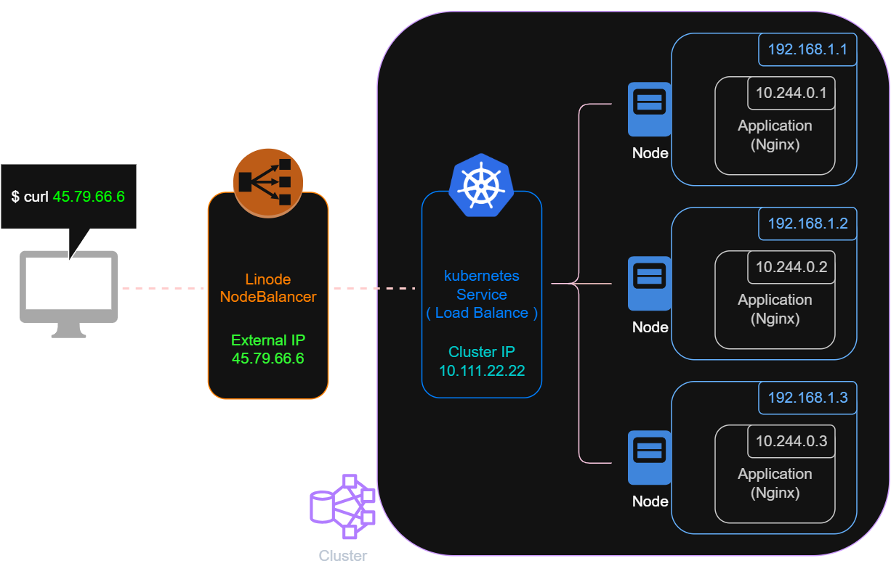

# linode-lke-terraform

透過 Terraform 建立 Linode Kubernetes Engine (LKE) Cluster 並部署 nginx 應用服務

## 系統架構



此配置會部署以下資源：
- **Linode LKE Cluster**：含有 3 個 Nodes 的託管 Kubernetes Cluster
- **nginx Deployment**：3 個 Replicas 的 nginx:1.14.2 在 Port 80 上運行
- **Load Balancer Service**：提供外部訪問 nginx Application，Kubernetes Service (Type: LoadBalancer) 會自動觸發 Linode 建立對應的外部 NodeBalancer

## 前置需求

1. **Linode 帳戶**：在 [linode.com](https://www.linode.com/) 建立 Linode 帳戶
2. **Linode API Token**：建立 `Personal Access Token` 供 Terraform 使用（Terraform 需要此 Token 才能在 Linode 上建立資源）
3. **Terraform**：安裝 Terraform 1.0 或更新版本
4. **kubectl**：用於手動管理 Cluster

## 🚀 快速開始

1. **複製配置文件**

```bash
cp terraform.tfvars.example terraform.tfvars
```

2. **編輯配置文件，填入 API Token**

編輯 `terraform.tfvars`，將 `linode_token` 設為你的實際 Token：

```bash
vim terraform.tfvars
# 找到這行，填入你的 token：
# linode_token = "YOUR_LINODE_API_TOKEN_HERE"
```

3. **初始化 & 部署**

```bash
terraform init
terraform plan
terraform apply
```

4. **連接到 Cluster**

`kubeconfig.yaml` 檔案會在執行完 `terraform apply` 後自動生成，可使用它來連接 cluster

Linux/macOS：
```bash
export KUBECONFIG=$(pwd)/kubeconfig.yaml
kubectl get nodes
```

Windows PowerShell：
```powershell
$env:KUBECONFIG="$(Get-Location)/kubeconfig.yaml"
kubectl get nodes
```

5. **訪問應用**

取得 LoadBalancer 分配的外部 IP

```bash
# 查看 EXTERNAL-IP 欄位（即 Linode NodeBalancer 的公開 IP）
kubectl get service web-server-service

# 用外部 IP 訪問 nginx
curl http://<EXTERNAL-IP>
```

> **［ Service IP 說明 ］** 
> `kubectl get service web-server-service` 會顯示兩個 IP：
> - Cluster IP：Kubernetes Service 的內部虛擬 IP，用於集群內部通信
> - External IP：Linode NodeBalancer 的公開 IP，用於外部用戶訪問
> 
> Cluster IP 和 External IP 都對應同一個 Service 物件，最終會轉導到同一批 Pods。

6. **清理資源**

```bash
terraform destroy
```

## 📁 檔案結構

```
📁linode-lke-terraform/
├── 📄 provider.tf                    # Terraform 和 Linode provider 配置
├── 📄 variables.tf                   # 變數定義
├── 📄 lke.tf                         # Linode LKE Cluster 資源配置
├── 📄 deployment.tf                  # Kubernetes Deployment 和服務配置
├── 📄 outputs.tf                     # 輸出值定義
├── 📄 terraform.tfvars               # 變數值（根據需要自訂）
├── 📄 terraform.tfvars.example       # 變數值範例
├── 📄 terraform.tfstate              # Terraform 狀態檔（自動生成）
├── 📄 terraform.tfstate.backup       # Terraform 狀態備份（自動生成）
├── 📄 .gitignore                     # Git 忽略文件配置
├── 📄 README.md                      # 專案說明文件
└── 📁 docs/                          # 架構圖文件
```

## ⚠️ 注意事項

1. **💰 付費資源請及時銷毀** - 配置包含 Linode 的 3 個 Node + 1 個 LoadBalancer，用完記得立即執行 `terraform destroy` 避免持續扣款
2. **🔧 K8s 版本可自訂** - LKE 自動使用最新穩定版本，需要指定版本請在 `lke.tf` 設定
3. **🔐 Linode API Token 不要洩露** - 可使用 `terraform.tfvars` 或環境變數 `TF_VAR_linode_token` 設定，不要提交到 Git
4. **⚙️ 自訂部署設定** - 可自行編輯 `terraform.tfvars` 調整部署參數（如 `cluster_label`、`node_pool_count`、`deployment_replicas`）；若要調整 CPU/記憶體限制，請在 [deployment.tf](deployment.tf) 中修改 `resources` 區塊
